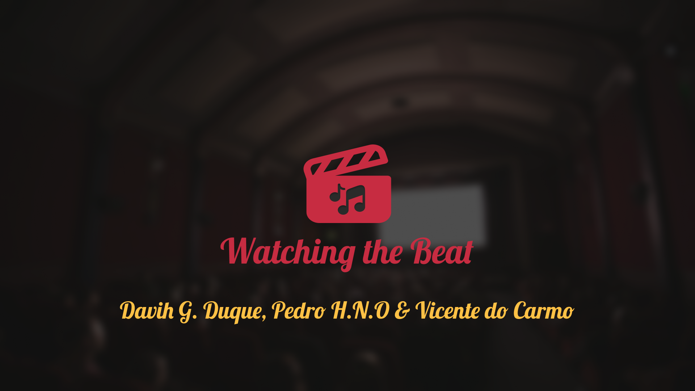
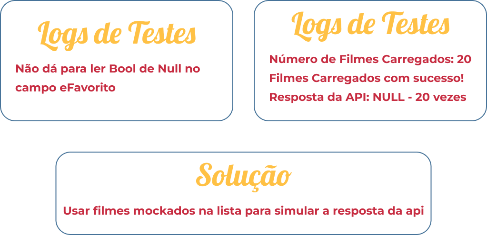

<h1 align="center">
   Watching the Beat
</h1>

  

## 💻 Projeto
O WTB é um aplicativo que une cinema e música, criando uma experiência imersiva onde imagem e som se complementam. 
A proposta é explorar como a música amplifica as emoções nos filmes, proporcionando uma nova forma de apreciá-los.
Inicialmente, planejamos usar a API do TMDB, mas devido a dificuldades técnicas, optamos por criar uma lista de filmes armazenada na memória, salva no banco de dados e associada ao usuário.
O aplicativo exibe os filmes em uma lista simples, permitindo que o usuário logado adicione ao seus favoritos, garantindo uma experiência personalizada e alinhada à proposta original: oferecer a perfeita harmonia entre cinema e música.

## Estrutura do Banco de Dados

O banco de dados do WTB é estruturada em um relacionamento 1:N, onde cada usuário pode vincular diversos filmes ao seu perfil. 
Esse vínculo é estabelecido pelo ID exclusivo do usuário, garantindo que cada seleção de favoritos seja armazenada e acessada de forma personalizada. 

Essa abordagem permite que cada usuário construa sua própria coleção de filmes favoritos, mantendo a organização e a integridade dos dados no banco de dados.

  

## Desafios com API
Conforme mencionado, enfrentamos diversos problemas na implementação da API. 
Inicialmente, o erro estava relacionado à inserção na classe modelo: mesmo ao definir o campo eFavorito, ele era constantemente retornado como null.

Realizamos várias edições na estrutura do código, tentando ajustar as definições e adaptar as requisições. 
Contudo, mesmo seguindo a estrutura recomendada pela documentação oficial da API, a resposta completa continuava retornando null, o que nos impediu de obter os dados corretamente e exigiu uma reformulação na abordagem do projeto.

  

